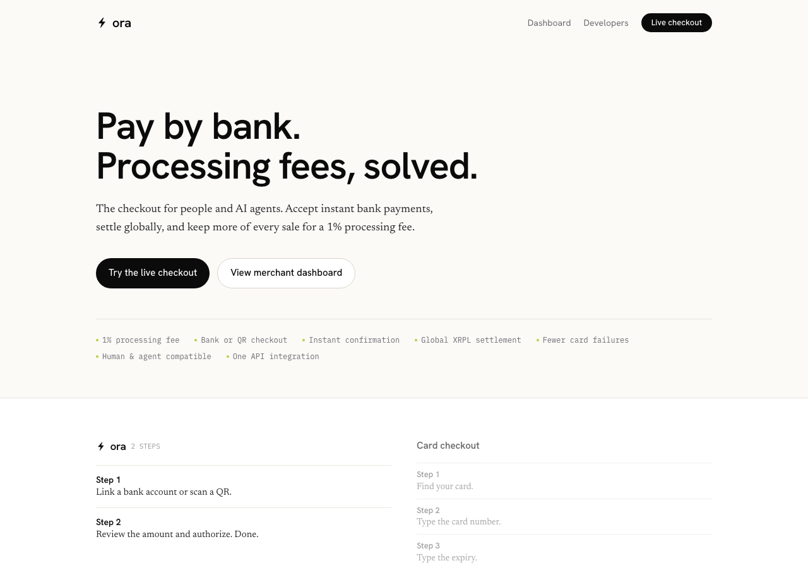
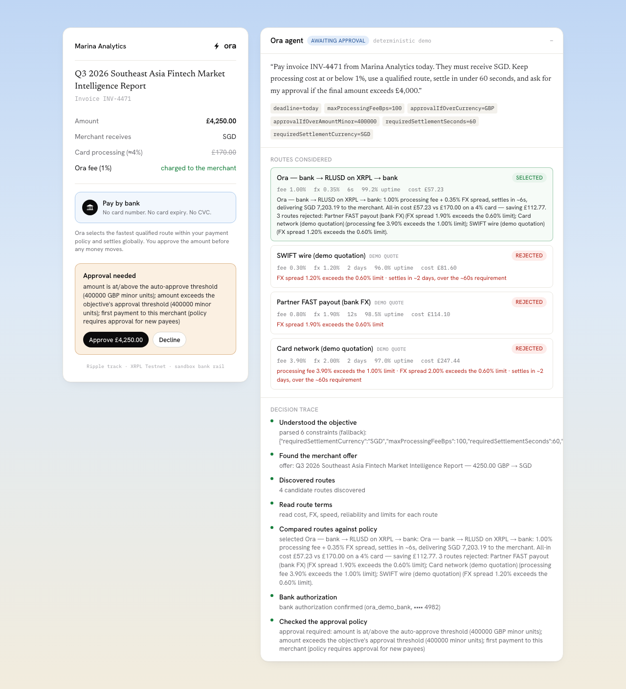
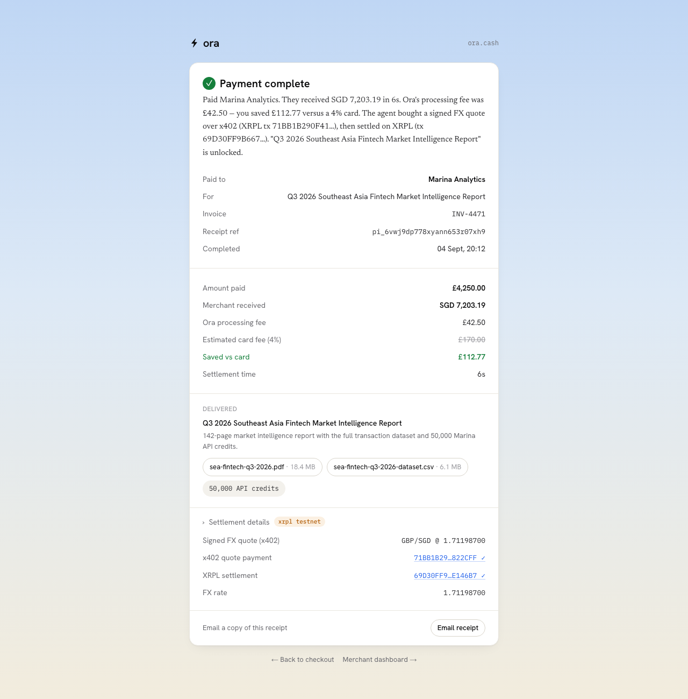
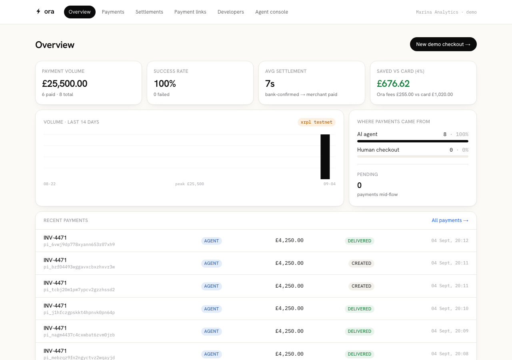
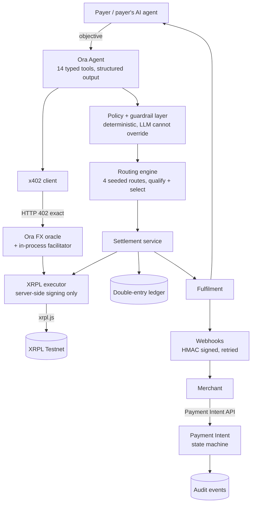

# Ora — the checkout for people and AI agents

> **Pay by bank. Processing fees, solved.**
> Ora lets people and AI agents pay any business directly from a bank account in
> seconds — routing every payment through the cheapest qualified path and settling
> globally for a **1% processing fee**.

**SingHacks 2026 · Ripple track — "AI-Native Business on XRPL".**
This is a Ripple-track submission. It is not a wealth-management or
relationship-manager tool.

Challenge repo: <https://github.com/Singhacks-2026/ripple> · provenance fork:
<https://github.com/Akdoraa/ripple-challenge> · the original challenge materials
are retained here (`hook/`, `skills/`, `resources.md`, `agent-instruction.md`,
`Singhacks-challenge-statement.pdf`, `docs/CHALLENGE.md`).

---

## What Ora solves — and who pays whom

Businesses lose **~3–4% of revenue** to card processing. Cards also expire,
decline, create checkout churn and chargeback exposure, and often settle in
3–7 days. For B2B, SaaS, marketplace and professional-services payments the card
rewards are not worth that cost.

Ora replaces the **checkout integration**, not the bank account:

| | |
|---|---|
| **Who pays** | The payer (a person or their AI agent) authorizes a payment straight from a bank account or QR. |
| **Who is charged the fee** | The **merchant** pays Ora a flat **1%** processing fee. FX, where it applies, is disclosed separately. |
| **Who receives value** | The merchant receives normal fiat in their settlement currency, with immediate confirmation, a webhook, reconciliation, and settlement detail. |
| **What the AI agent discovers & decides** | It parses a natural-language objective into hard constraints, discovers candidate routes, compares cost / FX / speed / reliability / limits, rejects routes that violate policy, and explains why the winner won. |
| **What is purchased over x402** | A **signed, time-limited FX & liquidity quote** from Ora's oracle. It locks the settlement rate — the settlement executor refuses to convert without a valid one. |
| **What happens on XRPL** | Two genuine XRPL **Testnet** transactions: (1) the x402 machine-to-machine payment for the quote, (2) the merchant settlement. Both are verified on a validated ledger and shown with their hashes + explorer links. |
| **What is delivered** | After verified settlement, fulfilment unlocks the purchased outcome (in the demo: a market-intelligence report + 50,000 API credits). |
| **Why agents make it materially better** | Without the agent, route discovery, policy interpretation, comparison, and autonomous purchasing revert to manual work. Without autonomous payment, the agent stops at a recommendation instead of completing the commercial outcome. |
| **How 4% → 1%** | Ora keeps a single explicit 1% processing fee and a small, disclosed FX spread; it routes bank-to-bank over instant rails and uses XRPL + RLUSD underneath for the agentic and cross-border legs, instead of the card networks' stacked interchange + scheme + cross-border + FX fees. |

### Live vs sandbox vs testnet vs planned

| Component | Status |
|---|---|
| Hosted checkout, Payment Intent API, agent orchestration, policy engine, routing, double-entry ledger, webhooks, idempotency, audit trail | **Live** in this app |
| AI agent objective parsing + receipt prose | **Live** with `ANTHROPIC_API_KEY`; deterministic **demo** fallback otherwise (still a full, auditable tool-using run) |
| x402 `exact` scheme + Ora's in-process facilitator | **Live**, verifying against XRPL **Testnet** |
| XRPL settlement + x402 payment | **Testnet** — real transactions, real hashes. On-chain value moves in **XRP** because the Testnet RLUSD faucet is GitHub-gated at 10 RLUSD/24h (`docs/evidence/feedback-submissions.md`); the RLUSD code path is exercised automatically for any RLUSD-funded wallet and on Mainnet |
| Bank rail | **Sandbox** — `DemoBankProvider` behind a `BankRailProvider` interface; production adapters for licensed open-banking / FAST / PayNow partners are documented in `docs/BANK_BOUNDARY.md` |
| KYC/KYB, sanctions screening, custody, licensed fiat movement | **Planned** — integration boundaries documented, not implemented |

Ora is **not** a licensed bank, payment institution, custodian, or money
transmitter. See `docs/BANK_BOUNDARY.md`.

---

## Run it

```bash
pnpm install
pnpm xrpl:setup        # creates + faucet-funds 4 XRPL Testnet wallets, writes seeds to .env.local
pnpm db:migrate        # applies migrations to an embedded PGlite database (zero infra)
pnpm db:seed           # seeds the UK -> Singapore demo
pnpm dev               # http://localhost:3000
```

Then open **<http://localhost:3000/demo>** and click *Authorize with Ora agent*.

- No Docker or Postgres needed for local dev — Ora uses embedded **PGlite** by
  default. Set `DATABASE_URL=postgres://…` (or run `pnpm db:up` for the bundled
  `docker-compose` Postgres) to use real Postgres; production uses Neon.
- The agent runs in deterministic **demo mode** until you add `ANTHROPIC_API_KEY`
  to `.env.local`. Everything else is unchanged.
- `.env.example` documents every variable; `src/env.ts` validates them with Zod.

### One-shot headless demo

```bash
pnpm dev          # terminal 1
pnpm demo:run     # terminal 2 — drives the full loop over HTTP, prints + records the two tx hashes
```

### Checks

```bash
pnpm check        # lint + typecheck + unit tests + production build
pnpm test:e2e     # Playwright: landing -> checkout -> agent -> approve -> x402 -> settle -> receipt -> dashboard
```

---

## Screenshots

| | |
|---|---|
|  |  |
|  |  |

## The demo scenario

A UK business (**Kestrel Digital**, holds GBP) buys a **£4,250.00** market-
intelligence package from a Singapore merchant (**Marina Analytics**, wants SGD).
The payer's agent is given:

> *"Pay invoice INV-4471 from Marina Analytics today. They must receive SGD. Keep
> processing cost at or below 1%, use a qualified route, settle in under 60
> seconds, and ask for my approval if the final amount exceeds £4,000."*

The agent parses that, discovers **4 routes**, qualifies exactly **1** (Ora
XRPL+RLUSD rail) and rejects the other 3 with specific reasons (FX spread, fee,
settlement time), pauses for human approval (£4,250 > £4,000 and a new payee),
then — on approval — makes a **real x402 Testnet payment** for the signed FX
quote and a **real XRPL Testnet settlement**, delivers the report + API credits,
and produces a receipt showing the 1% fee and the saving versus a 4% card.

`DEMO_SCRIPT.md` is the walkthrough. `docs/evidence/xrpl-transactions.md` has the
recorded hashes and explorer links.

---

## Architecture



Full detail: `docs/ARCHITECTURE.md` · sequence: `docs/SEQUENCE.md` ·
agent: `docs/AGENT.md` · x402: `docs/X402.md` · XRPL: `docs/XRPL.md` ·
security: `docs/SECURITY.md` · API: `docs/API.md` ·
rubric mapping: `docs/RUBRIC_COVERAGE.md`.

## Stack

Next.js 16 (App Router) · React 19 · TypeScript strict · Tailwind v4 ·
Drizzle ORM (PGlite locally / Postgres in prod) · Vercel AI SDK + `@ai-sdk/anthropic` ·
`xrpl` 5 · `x402-xrpl` · Zod · Vitest + Playwright · pino.

## Known limitations & production roadmap

See `docs/ROADMAP.md`. In short: Testnet settles in XRP not RLUSD (faucet limit);
the bank rail is a sandbox; auth is demo-scoped to one merchant; the agent's
route catalogue is seeded, not a live provider marketplace; deployment to
Vercel + Neon needs the operator's own accounts.

## Deployed demo

See `docs/DEPLOY.md`. `vercel.json` and the Neon-compatible migration/seed path
are in place; connecting the accounts is a hand-off step for the operator.
