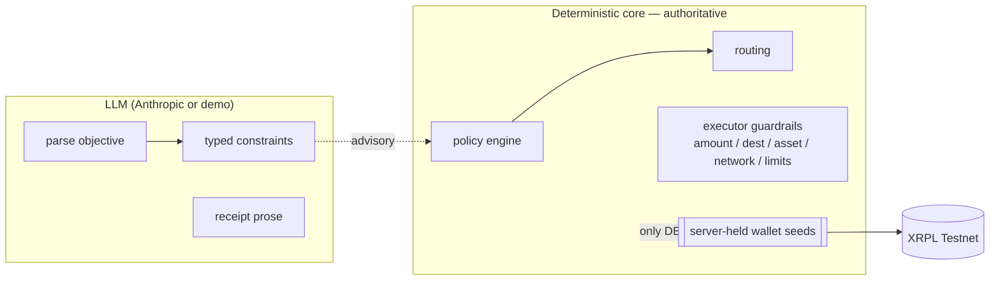

# Ora — architecture

Single Next.js 16 app. No microservices — modules under `src/lib/*`, route
handlers under `src/app/api/*`, pages under `src/app/*`.

## Modules

| Module | Path | Responsibility |
|---|---|---|
| env | `src/env.ts` | Zod-validated config; server-secret guard; resolves agent mode + db driver |
| db | `src/db/` | Drizzle schema (all domain objects); PGlite (dev) / node-postgres (prod) behind one type |
| money | `src/lib/money/` | Exact `Money` — bigint minor units + ISO currency; decimal.js for FX & bps with explicit rounding; `Intl` formatting |
| payment-intents | `src/lib/payment-intents/` | Explicit state machine (`state-machine.ts`) + `applyTransition` (persist + audit) + aggregate reads |
| ledger | `src/lib/ledger/` | Immutable double-entry; `postTransaction` asserts Σ=0 per currency; lifecycle helpers; `trialBalance` |
| routing | `src/lib/routing/` | 4 seeded route templates → quotes (fee, FX cost, merchant net, savings vs 4% card); `evaluateRoutes` + `selectRoute` |
| policies | `src/lib/policies/` | `ParsedConstraints` (only tighten policy); `effectiveConstraints`; `requiresApproval`; `hardSpendGuard` |
| bank-rails | `src/lib/bank-rails/` | `BankRailProvider` interface + `DemoBankProvider` (authorize/QR/confirm/fail/expire/cancel) |
| x402 | `src/lib/x402/` | `server` (402 challenge), `client` (presigned payer + guardrails), `facilitator` (pre-submit checks + settle on Testnet), `oracle` (issue signed FX quote), `quote` (HMAC sign/verify) |
| xrpl | `src/lib/xrpl/` | shared ws client; named server-held wallets; XRP+RLUSD amounts; `executor` (validate → autofill → local sign → submitAndWait → verify); `verify` (independent re-read) |
| settlement | `src/lib/settlement/` | signed-quote check → ledger legs → XRPL payout → payable discharge → settlement row → fulfil → webhook |
| agent | `src/lib/agent/` | `model` (Anthropic + deterministic fallback), `parse-objective`, `tools`, `runner` (orchestrator + `agentDecisions` trace, pause/resume at approval) |
| fulfilment | `src/lib/fulfilment/` | deliver only after verified settlement; one-time access token |
| webhooks | `src/lib/webhooks/` | HMAC-SHA256 signature, `webhook_deliveries` with attempts + backoff, replay |
| audit | `src/lib/audit/` | append-only `audit_events` |
| analytics | `src/lib/analytics/` | merchant overview / payments / settlements / webhook log / volume series |
| refunds | `src/lib/refunds/` | full refund: ledger reversal + on-chain refund leg |

## Trust boundary

The LLM never holds a key, never signs, and cannot loosen a policy or spend cap.
`requiresApproval` and `hardSpendGuard` are re-checked in code; the XRPL executor
re-validates amount, destination, asset, network, and the invoice binding before
the server-held wallet signs locally.

## Data & state

- Money: `bigint` minor units + `char(3)` currency everywhere. Never a float.
- Payment intent state machine: `src/lib/payment-intents/state-machine.ts` —
  `created → awaiting_route → route_selected → awaiting_bank_authorization →
  bank_confirmed → awaiting_agent_approval → x402_quote_paid → settling → paid →
  delivered`, plus `authorization_failed / payment_failed / settlement_failed /
  fulfilment_failed / expired / cancelled / partially_refunded / refunded` and
  retry edges. Illegal transitions throw `InvalidTransitionError`.
- Ledger accounts: `funds_pending`, `settlement_liquidity`, `merchant_payable:{id}`,
  `processing_fee_revenue`, `fx_spread_revenue`, `refunds_payable`, `external_world`.
- Idempotency: `Idempotency-Key` on external POSTs → `idempotency_keys` stores the
  response; ledger `postTransaction` dedupes on `idempotencyKey`.
