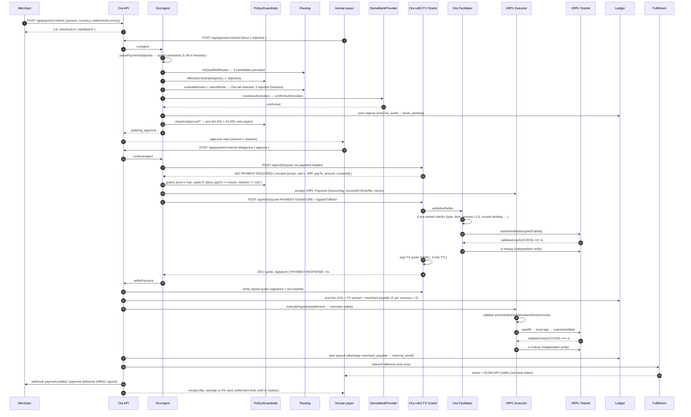

# Ora — end-to-end sequence

The seeded demo, from merchant integration to delivered outcome.

Failure edges (each reaches a recoverable, explained state and a webhook):
bank `fail`/`expire` → `authorization_failed` / `expired`; approval `reject` →
`cancelled`; x402 not settled → stays `x402_quote_paid`, retriable; XRPL
`executePayment` throws → `settlement_failed` (retry edge); expired quote →
`QuoteExpiredError` before any settlement leg.
